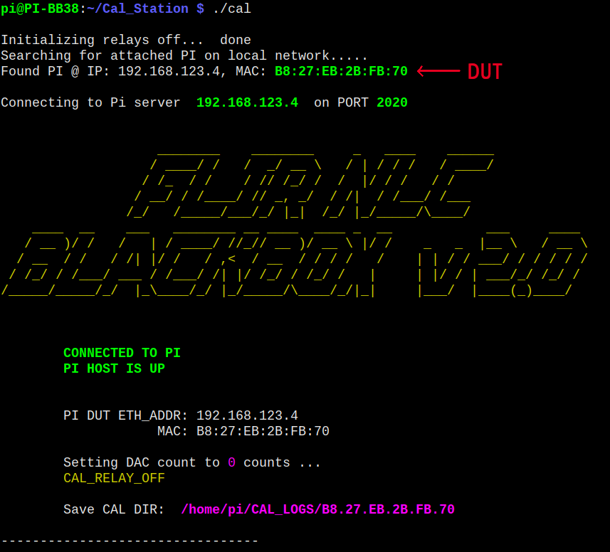

# Blackbox_Calibration

- [Blackbox_Calibration](#blackbox_calibration)
  - [Program Overview](#program-overview)
  - [Required Libraries](#required-libraries)
  - [Downloading Code and Compiling](#downloading-code-and-compiling)
  - [Giving Pi User Permission to Access **/dev/ttyUSB** & **/dev/usbtmc**](#giving-pi-user-permission-to-access-devttyusb--devusbtmc)
  - [Pi DUT Connection:](#pi-dut-connection)
  - [Program Start:](#program-start)
  - [Menu Structure](#menu-structure)
  - [SSH File Upload and BCM2835 Installation](#ssh-file-upload-and-bcm2835-installation)
  - [Calibration Pi Directory Structure](#calibration-pi-directory-structure)
  - [DUT Pi Directory Structure](#dut-pi-directory-structure)
  - [LUT Production inputs:](#lut-production-inputs)
  - [LUT Outputs:](#lut-outputs)
  - [Instructions For Use](#instructions-for-use)
    - [First Iteration of Cal Routines in Automatic Calibration](#first-iteration-of-cal-routines-in-automatic-calibration)
      - [Thermocouple Measurement](#thermocouple-measurement)
      - [REF100 Current Measurement](#ref100-current-measurement)
      - [Diode Voltage Measurement and Calibration](#diode-voltage-measurement-and-calibration)
      - [AC Current Measurement](#ac-current-measurement)
      - [Pi DAQ Output Voltage Calibration](#pi-daq-output-voltage-calibration)
      - [Pi DAQ Load Current Calibration](#pi-daq-load-current-calibration)
      - [Process Log Files, Create LUT](#process-log-files-create-lut)
      - [SSH File Transfer & Server Initialization](#ssh-file-transfer--server-initialization)
  - [Cal_Parameters.h, Cal_Parameters.cpp](#cal_parametersh-cal_parameterscpp)

This application is used to calibrate the Raspberry Pi based DAQ, which datalogs metrics for coolers. This application runs on Raspberry Pi, which is used to control relays, test equipment, and the Raspberry Pi being calibrated. The Raspberry Pi this application runs on is housed inside a 'Calibration Relay Box', which multiplexes different signals to the meters to be tested. 

The test equipment used is:


The communication setup:

A USB Hub can be used to connect all USB devices, then the Pi can be connected to the hub.

## Program Overview

The application performs the following tasks:
  - searches local Ethernet network for attached Raspberry Pis
  - finds a Raspberry Pi to calibrate, and connects to it
  - searches the linux device tree for attached USB test equipment
  - connects to and configures the test equipment
  - runs calibration tests, controlling relays to direct signals to the meters
  - writes the test data to log files
  
After Calibration Runs have been completed, the application processes the log files into LUTs:
  - parses the log files
  - throws out outlier data
  - sorts data into groups of similar values
  - filters out data with high variance
  - averages data groups into look up table points
  - writes the LUT points to a C header file, which is usable by the DUT

Finally, the application connects to the DUT, and writes the LUT files
 - connects to the DUT via SSH
 - writes the LUT files
 - installs libbcm2835 if necessary
 - compiles the Pi DAQ firmware with the new LUT files
 - starts the PI DAQ server
 - verifies the server process is operating correctly

  
The datalog files aer compiled into lookup tables. The data is sorted, filtered, and averaged to produce accurate LUT points. C code header files are produced which contain the LUT points. After all LUTs have been created, the LUT files are transferred via SSH to the Pi being calibrated. 
The Pi DAQ firmware is then compiled remotely, with the new LUT files. Finally, the DAQ Server process on the Pi is initiated.

## Required Libraries
Required libraries to compile this code are:
   - [BCM2835](https://www.airspayce.com/mikem/bcm2835/) (Raspberry Pi gpio library)
   - [libssh](https://www.libssh.org/)  ...library for ssh access. See [libssh install notes](./md/libssh_install.md) to compile on Pi from source

BCM2835 may be downloaded from the above link. If you are on the Pi, here are the commands to download and install BCM2835 library:
```
sudo apt-get install -y html-xml-utils   
wget -P /home/pi/Downloads/ http://www.airspayce.com/mikem/bcm2835/bcm2835-1.62.tar.gz;   
cd /home/pi/Downloads    
tar zxvf bcm2835*.tar.gz   
cd /home/pi/Downloads/bcm2835*   
/home/pi/Downloads/bcm2835-1.62/configure   
make   
sudo make check   
sudo make install   
```

**libssh** is also required to automatically transfer the LUT files to the Pi DUT. As of right now there is not an up to date, ready to use,  **libssh** package for the Raspberry Pi. It needs to be compiled from source. I ran into some difficulties doing this, see instructions on how to compile 
libssh [here](./md/libssh_install.md)   

## Downloading Code and Compiling
to build the Calibration executable, first make a dir to store the source code:
```
mkdir /home/pi/Cal_Station  
cd /home/pi/Cal_Station  
```
download the source files with:  

```git clone https://github.com/johnpolakow/Blackbox_Calibration.git```    


The following files should now be present in the directory:   


As seen above there is a makefile. To compile the code just type 'make':  
  
  
Easy.   

after issuing the **make** command, modules will be succesively compiled, then all object files are linked. On the Pi, it will take 2-3 minutes to finish compiling. 

after the calibration program has built successfully, a creatively named binary, '**cal**', is produced. 
to execute the code, simply type: 
***```./cal  ```***
Note: do not use sudo to execute. It is not necessary, and application will look in the wrong directory for ssh keys if run as root user. See next section for giving permissions to the pi user for accessing /dev/ttyUSB and /dev/usbtmc devices

## Giving Pi User Permission to Access **/dev/ttyUSB** & **/dev/usbtmc**
The user pi user needs access to /dev/ttyUSB and /dev/usbtmc to be able to communicate with the test equipment. This describes how to set up permissions for user pi.   
pi user must be in the following groups:
  - pi  
  - adm  
  - dialout  
  - plugdev  
  - gpio  
  - spi  
  - input  
  - netdev  
  - i2c  
  - sudo

To see what groups the pi user is in, enter the command ``groups``
  

To add the pi user to a group (in this case to the dialout group) enter the command:   
``sudo usermod -a -G dialout pi``

verify the pi user belongs to the above groups. Add pi to any groups not present in the above list.   

Next, some rules must be set that give groups permission to access /dev/ttyUSB. The rule files needed are included with this repo, in the **etc/** folder:   
   - 99-com.rules   
   - 70-ttyUSB.rules   
   - 11-yokogawa-wt310e.rules   

Move these three files to the /etc/udev/rules.d/ directory on the pi with this command:   
```sudo mv *.rules /etc/udev/rules.d/```

Those three files should now be in the /etc/udev/rules.d/ directory

Next, create a new group **usbtmc**:   
```sudo groupadd usbtmc```    

Add pi user to the group:   
```sudo gpasswd -a pi usbtmc```    
  

list the current owner and group of usbtmc0:    
```la /dev/usbtmc0```    
    


It still belongs to the root user and group. To update, we need to reload the rules. Enter the commands:     
```sudo udevadm control --reload-rules```    
```sudo udevadm trigger```   
   

to give the devices the new permissions, either unplug the device USB, then plug it back in, or reboot the Pi.   
(sudo reboot -h now)
check the permissions to the usbtmc devices again and see if you now have access:
  
you can see above that /dev/usbtmc0 belongs to the usbtmc group

Creating A Rules File
If you don't have the '11-yokogawa-wt310e.rules' file, it can be created. change directories to **/etc/udev/rules.d/**

find out what the device manufacturer and ID are, of the USB attached test equipment,  with the **lsusb** command:    
```sudo lsusb```    
    
here we see the device manufacturer and ID for the Yokogawa is 0b21 & 0025. Remember these values   


Now create the new rules file. enter the command:
```sudo vi 11-yokogawa-wt310e.rules```
  

If you're not familiar with vi, hit the **i** key to insert text.    
Enter the following lines into the file. Make sure the quantity of equals signs match exactly   
``` 
SUBSYTEM=="usb", ACTION=="add", ATTRS{idVendor}=="0b21", ATTRS{idProduct}=="0025", GROUP="usbtmc", MODE="0666"

KERNEL=="usbtmc[0-9], GROUP="usbtmc", MODE="0666"
KERNEL=="usbtmc*, GROUP="usbtmc", MODE="0666"
```
  

if you make a mistake entering the text, hit the escape key to exit insert mode, then move the cursor with arrow keys to text you want to delete, then hit the **x** key to delete characters. When all text has been entered correctly hit the escape key, then to save and quit enter **:wq**

now either unplug the device and plug back in, or reboot to reset the permissions

then can list the device permissions again with:
```la /dev/usbtmc0```

you can see owner changed to usbtmc
  

## Pi DUT Connection:
the Pi unit to be calibrated needs to connect to the Pi residing in the calibration box, via Ethernet cable. The subnet for this network is 192.168.123.XXX
The default IP for the calibration box Pi is 192.168.123.7. Below is a picture of how the test equipment should be connected. As noted before, the IP Address of the Pi controlling the *Calibration Box* is 192.168.123.7. The Pi DUT therefore needs to have an IP address in the form of 192.168.123.XXX
  

## Program Start:
First the application searches the local Ethernet connection for any Raspberry Pis. If found it will show the IP and MAC of the Pi it is connecting to. If the PI DAQ server process is running, a message will be displayed showing "PI HOST IS UP". Also shown will be the directory of where log files are stored (on the Calibration Box Pi). Each Pi has its data saved in a folder identified by its MAC address:


Next the application will try to connect to the 4 pieces of test equipment:
   - 2x HP34401 6.5 digit DMM
   - Agilent E3648A Power Supply   

Any USB attached devices which support SCPI are queried. Their SCPI ID string is displayed in the program (indicated by red arrows below) 
See [Test Equipment](./md/test_equipment.md) page for more information if you are having difficulty connecting   
   

Last, the application will try to locate the Yokogawa WT310E on the ***/dev/usbtmc*** interface:   
   

If the application is unable to find all 4 pieces of test equipment, the program exits.   

Something to keep in mind:
the application identifies the HP meters and Agilent Power Supply by their individual SCPI ID. This is the value returned by executing the SCPI query: **\*IDN?**
over RS232 or gpib.   
Why this is important: if you use a physically different HP34401 meter or Agilent E3648 power supply, they will not be identified correctly. The ID# is shown in the image above. If you need to change the ID this application is looking for, adjust the following strings in Cal_Parameters.cpp:
```
const char* HP_A_ID = "0,11-5-2";  
const char* HP_B_ID = "0,2-1-1";  
const char* AGILENT_PS_ID = "0,1.7-5.0-1.0";  
```
Additionally, if the Raspberry Pi inside the Relay calibration box is changed, the MAC Address of the replacement Pi needs to updated in the same Cal_Parameters.cpp. Edit this parameter:
```const char* CAL_STATION_MAC_ADDR = "B8:27:EB:2E:B7:3A";```     

This is used during auto detection of pis connected to the network. It is necessary to filter out the PI in the calibration box, so it is not thought of as a potential calibration candidate.

If all test equipment is detected correctly, the application proceeds to the main menu.

## Menu Structure
There is the option to perform calibration automatically or manually. Manual calibration is somewhat a misnomer, the calibration is still automatic is just entails selecting the individual calibration programs to run. There is no manual data collection necessary. 

If manual calibration is selected, the following menu is displayed:
   
the estimated time to complete each calibration program is listed.
when you are finished running cal items, then select done (7)

Next the LUT menu is displayed:
   
On the right side, the log files available for processing into LUTs are shown. The log files are stored on the calibration Pi in the directory:   
```/home/pi/CAL_LOGS/[DUT_MAC_ADDR]/```

Here is an example processing the **COOLER_V.log** file. The file is parsed. The read file and target LUT file locations are shown.  
The data is scanned in and outlier points discarded.   
   
 
Data is grouped by similar values, and averaged to produce LUT points:      
    
 
The LUT is produced into a C .h header file, and stored locally in ```/home/pi/CAL_LUT/[DUT_MAC_ADDR]/```    
    


After processing into a LUT, the log file is moved to ```/home/pi/CAL_LOGS/PROCESSED_LOGS/[DUT_MAC_ADDR]/```    
   


## SSH File Upload and BCM2835 Installation
--TODO--


## Calibration Pi Directory Structure   
Important home folders on the (Calibration Box) Pi are: CAL_LOGS, CAL_LUT, and Cal_Station:   
   

**Cal_Station/** contains the calibration program source files and binary. The **src/** file list is extensive:  
    
   
   
89 source files!

**CAL_LOGS/** contains data files gathered during calibration. They are organized by MAC address of the PI DAQ being calibrated:  
  
you can see in the above image, the log files have already been scraped for data and converted into LUTs (they have been moved to the processed logs directory).  
If needed, the logs can be manually moved back to the unprocessed log folder.   
Note: the REF100 log and Thermocouple log are never processed into LUTs. 

The **CAL_LUT/** directory:   
    

## DUT Pi Directory Structure
The home directory on the Pi DUT:   
    

The Pi DAQ firmware source files are located in the confusingly named **firmware** directory:   
   

The source files in this dir are:   
   


## LUT Production inputs:    
These are the files required to create LUT files
 - COOLER_mA.log
 - COOLER_V.log
 - DIODE_V.log
 - LOAD_mA.log
 - LOAD_V.log

some example log files are [here](./md/example_logs/)

## LUT Outputs:   
These are the LUT files created by the Calibration program:
 - COOLER_mA_LUT.h
 - COOLER_V_LUT.h
 - DIODE_V_LUT.h
 - LOAD_mA_LUT.h
 - LOAD_V_LUT.h


## Instructions For Use
Compile the Calibration Code as outlined earlier.  
Connect a Pi DAQ to be calibrated (DUT Pi), via Ethernet cable, to the Pi inside the Calibration Box.    
Verify the Pi DAQ has an IP Address in the range of:  192.168.123.1 - 192.168.123.254.    
--Do not use the IP Address 192.168.123.7--
Connect the 4 pieces of test equipment: Yokogawa WT310E, Agilent E3648, HP34401 x2  vi USB

Start the application with the command:   **./cal**   
Verify the 4 pieces of test equipment are detected correctly.

At the first menu, select Automatic Calibration.     
   

This will automatically run the routines for you. The different routines that are run are:    
   - Calibrate Load    
   - Measure REF100 Current    
   - Calibrate Pi DAQ measurement of Cooler Volts    
   - Calibrate Pi SAQ measurement of Cooler mA   
   - Calibrate Diode Voltage    
   - Measure Thermocouple Temperature   

### First Iteration of Cal Routines in Automatic Calibration    
This covers each calibration routine, to understand any cabling changes and what the test is doing.    
#### Thermocouple Measurement   
Cabling:
- 3 thermocouples are plugged into the Pi DAQ. (the yellow connectors at the front of the board)   
To compare measured temp between thermocouples, it helps to have them pressed against an isothermal surface, like a block of metal. I used a block of aluminum, and secured the thermocouple junctions to the aluminum with kapton tape. 10 readings are taken of each thermcouple. This is to show the measurement circuit is working correctly and temperatures are reasonably close in value.
   

#### REF100 Current Measurement
Cabling:  
  - DB9 connector is connected to the DB9 Header at the front of the Calbration Box   
  - HP_34401_B LO terminal is connected to J25
  - HP_34401_B HI terminal is connected to J24
  - HP_34401_A LO terminal is connected to J19
  - HP_34401_A HI terminal is connected to J18
THe REF100 IC is the current source to the temp diode in the dewar. The nominal value should be 100uA. This test measures the current source to verify it is within spec. 10 current measurements are taken, average and standard deviation are shown.   
   

#### Diode Voltage Measurement and Calibration
Cabling:  
  - DB9 connector is connected to the DB9 Header at the front of the Calbration Box   
  - HP_34401_B LO terminal is connected to J25
  - HP_34401_B HI terminal is connected to J24
  - HP_34401_A LO terminal is connected to J19
  - HP_34401_A HI terminal is connected to J18
The program pauses and waits for you to make the cable change:   
   
It is super easy to make this change.    
Connect a black banana lead from the E3648 power supply, Output 1 (-) terminal, to J20 on top of the Calibration Box.     
Connect a red banana lead from the E3648 power supply, Output 1 (+) terminal, to J17 on top of the Calibration Box.     
Make sure the DB9 connector from the Calibration Box is plugged into the DB9 header on the Pi DAQ.   
Then hit enter. The Agilent PS will output different voltages, in the range of diode Voltages we expect to see. The Pi DAQ will measure this Voltage, and simultaneously the HP34401_A will measure the same Voltage. The two values are recorded. The test output on the screen will show the difference in values.   
    
Here we are looking at a 63 uV difference. Pretty good.

#### AC Current Measurement    
Cabling:  
  - black banana is connected from the black output of the Pi to J2 on the top of the Calibration Box.    
  - red banana is connected from the red banana output of the Pi to J4 on the top of the Calibration Box.    
  - Yokogawa current in & current out are connected to Calibration Box J3 and J6.    
  - CCC is connected to the back of the Calibration Box, at connectors J5 & J7    

The Pi DAQ provides power to the CCC, and the CCC drives a compressor during cooldown.  The Pi measures the AC current to the CCC. The Yokogawa power meter also measures this current. The Yokogawa is continuously queried for its measured values.  The Pi DAQ measured values and the Yokogawa values are compared and recorded. The test continues until the Dewar reaches the cooldown setpoint temperature. At this point the CCC current will drop dramatically, to ~30 mA. The calibration program detects this condition, and stops the test when current dips under 100 mA. 
    


#### Pi DAQ Output Voltage Calibration    
Cabling:  
  - black banana is connected from the black output of the Pi to J25 on the back of the Calibration Box.    
  - red banana is connected from the red banana output of the Pi to J24 on the back of the Calibration Box.
  - black banana is connected from the E3648 PS Output 1 (-) to J25 on the back of the Calibration Box.    
  - red banana is connected from E3648 PS Output 1 (+) to J24 on the back of the Calibration Box. 
  - HP_34401_B LO terminal is connected to J25 (black)
  - HP_34401_B HI terminal is connected to J24 (red)

The Pi DAQ measures its output Voltage to the CCC. This test calibrates the Pi measurement. The Agilent E3648 provides controlled output Voltages. The Voltage is input to the Pi for measurement, and also measured by HP34401_B. The two values are compared and recorded.
  

#### Pi DAQ Load Current Calibration   
Cabling:  
  - DB9 connector is connected to the DB9 Header at the front of the Calbration Box   
  - HP_34401_B LO terminal is connected to J25 (black)
  - HP_34401_B HI terminal is connected to J24 (red)
  - HP_34401_A LO terminal is connected to J19 (black)
  - HP_34401_A HI terminal is connected to J18 (red)

The Pi DAQ provides a programmable current source to a 200 Ohm load resistor in the Dewar. The current disipates heat in the dewar, allowing for a programmable load to be placed on the IDCA. This test calibrates the Pi DAQ measured output Voltage and Current. The programmable current source is output at the DB9 Header. The Cal Box has 200R load inside with attached heat sink. THe HP34401_A and HP34401_B monitor the Voltage and Curent. The Values are compared to the Pi measured values. Note: at higher current levels you'll see the Pi measures a higher Voltage than the HP meter. This is normal and due to the Voltage drop through the cabling. 
  


#### Process Log Files, Create LUT
After calibration runs, the log files are stored in the **CAL_LOGS/** directory. The files are organized by the MAC address of the Pi DUT. For this board the MAC was   
B8.27.EB.2B.FB.70, hence the directory name:   
   

The files present are:    
   

The LUT menu is shown below:    
     

If you want to see the LUT filtering process you can select each file individually, or to process all files select option 6. Selecting option processes all log files into lookup table files. After each log file is processed, the file is moved to the PROCESSED_LOGS/ directory. See below after the logs have been processed, the files have been moved:   
    

The lookup tables are created at the CAL_LUT/ location, and organized by MAC address:   
  

The lookup present are:   
  


#### SSH File Transfer & Server Initialization     
SSH starts, and searches the local network for Pis. It connects to the first Pi available on the Ethernet network, via SSH. Next it checks if the remote host already has SSH configured, and has an authorized_keys file:    
  

If it has an authorized keys file, the file is read. Then the Cal application reads the local SSH keys, to see if the remote host has our keys already.   
  

If the remote host has our keys already, great. If not, the local SSH keys are sent to the remote host and written to the authorized_keys file, enabling future logins without password entry.    
  
Remote folders are created if they don't exist already.    

Next all the LUT files are sent:    
  

the target destination of LUT files is:  **/home/pi/firmware/CAL_DATA/**     

The Pi DAQ firmware is then remotely compiled by the Calibration application. it is easy to do. just execute the command make in the /home/pi/firmware/ directory:   
  

Last, the Calibration application remotely starts the Pi DAQ server and verifies the process is running properly:   
  
  


## Cal_Parameters.h, Cal_Parameters.cpp

There are other string definitions in the Cal_Parameters.cpp file, it is probably best to avoid making changes. The locations of various directories are defined.
DC Voltage Points are also defined for the diode calibration, and for calibration of the PI DAQ output voltage measurement (to CCC).

In Cal_Parameters.h are some parameters that adjust how data is filtered and grouped into lookup tables. Some of these apply to different LUTs that are created. 