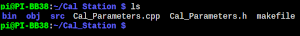
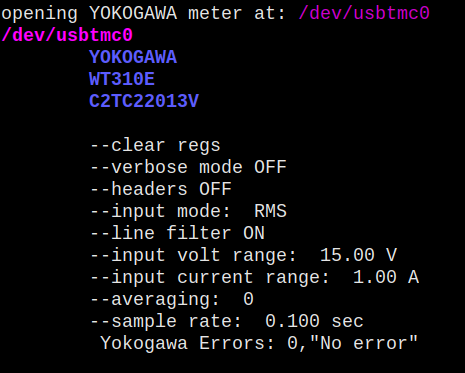

# Blackbox_Calibration

- [Blackbox_Calibration](#blackbox_calibration)
  - [PROGRAM OVERVIEW](#program-overview)
  - [DOWNLOADING CODE & COMPILING](#downloading-code--compiling)
  - [Pi DUT CONNECTION:](#pi-dut-connection)
  - [PROGRAM START:](#program-start)
  - [MENU STRUCTURE](#menu-structure)
  - [CALIBRATION PI DIRECTORY STRUCTURE](#calibration-pi-directory-structure)
  - [DUT PI DIRECTORY STRUCTURE](#dut-pi-directory-structure)
  - [PROGRAM OPERATION](#program-operation)

This application is used to calibrate the Raspberry Pi based DAQ, which datalogs metrics for coolers. This application runs on Raspberry Pi, which is used to control relays, test equipment, and the Raspberry Pi being calibrated. The Raspberry Pi this application runs on is housed inside a 'Calibration Relay Box', which multiplexes different signals to the meters to be tested. 

The test equipment used is:
[](./md/test_equipment.png)


The communication setup:
[](./md/test_setup.png)
A USB Hub can be used to connect all USB devices, then the Pi can be connected to the hub.

## PROGRAM OVERVIEW

The application performs the following tasks:
  - searches local Ethernet network for attached Raspberry Pis
  - finds a Raspberry Pi to calibrate, and connects to it
  - searches the linux device tree for attached USB test equipment
  - connects to and configures the test equipment
  - runs calibration tests, controlling relays to direct signals to the meters
  - writes the test data to log files
  
After Calibration Runs have been completed, the application processes the log files into LUTs:
  - parses the log files
  - throws out outlier data
  - sorts data into groups of similar values
  - filters out data with high variance
  - averages data groups into look up table points
  - writes the LUT points to a C header file, which is usable by the DUT

Finally, the application connects to the DUT, and writes the LUT files
 - connects to the DUT via SSH
 - writes the LUT files
 - installs libbcm2835 if necessary
 - compiles the Pi DAQ firmware with the new LUT files
 - starts the PI DAQ server
 - verifies the server process is operating correctly

  
The datalog files will be compiled into lookup tables. The data is sorted, filtered, and averaged to produce accurate LUT points. C code header files are produced which contain the LUT points. After all LUTs have been created, the LUT files are transferred via SSH to the Pi being calibrated. 
The Pi DAQ firmware is then compiled remotely, with the new LUT files. Finally, the DAQ Server process on the Pi is initiated.

## DOWNLOADING CODE & COMPILING
to use this code, first make a dir for the repo:
```
mkdir /home/pi/Cal_Station  
cd /home/pi/Cal_Station  
```
then clone the repo with:  

```git clone https://github.com/johnpolakow/Blackbox_Calibration.git```    


The following files should now be present in the directory:   


As seen above there is a makefile. To compile the code just type 'make':  
  


modules will be succesively compiled. On the Pi, it will take 2-3 minutes to finish compiling. Required libraries to compile this code are:
   - [BCM2835](https://www.airspayce.com/mikem/bcm2835/) (Raspberry Pi gpio library)
   - [libssh](https://www.libssh.org/)  ...library for ssh access. See [libssh install notes](./md/libssh_install.md) to compile on Pi from source

after the calibration program has built successfully, a creatively named binary, '**cal**', is produced. 
to execute the code, simply type: 
```./cal  ```
Note: do not use sudo to execute. It is not necessary, and application will look in the wrong directory for ssh keys if run as root user.

## Pi DUT CONNECTION:
the Pi unit to be calibrated needs to connect to the Pi residing in the calibration box, via Ethernet cable. The subnet for this network is 192.168.123.XXX
The default IP for the calibration box Pi is 192.168.123.7

## PROGRAM START:
First the application searches the local Ethernet connection for any Raspberry Pis. If found it will show the IP and MAC of the Pi it is connecting to. If the PI DAQ server process is running, a message will be displayed showing "PI HOST IS UP". Also shown will be the directory of where log files are stored (on the Calibration Box Pi). Each Pi has its data saved in a folder identified by its MAC address:


Next the application will try to connect to the 4 pieces of test equipment:
   - 2x HP34401 6.5 digit DMM
   - Agilent E3648A Power Supply   
Any USB attached devices which support SCPI are queried. Their SCPI ID string is displayed in the program (indicated by red arrows below) 
See [Test Equipment](./md/test_equipment.md) page for more information if you are having difficulty connecting


Last the application will try to locate the Yokogawa WT310E on the ***/dev/usbtmc*** interface:


If the application is unable to find all 4 pieces of test equipment, the program exits.   

Something to keep in mind:
the application identifies the HP meters and Agilent Power Supply by their individual SCPI ID. This is the value returned by executing the SCPI query: \*IDN?
over RS232 or gpib.   
Why this is important: if you use a physically different HP34401 meter or Agilent E3648 power supply, they will not be identified correctly. The ID# is shown in the image above. If you need to change the ID# this application is looking for, adjust the following strings in Cal_Parameters.cpp:
```
const char* HP_A_ID = "0,11-5-2";  
const char* HP_B_ID = "0,2-1-1";  
const char* AGILENT_PS_ID = "0,1.7-5.0-1.0";  
```
Additionally, if the Raspberry Pi inside the Relay calibration box is changed, the MAC Address of the replacement Pi needs to updated in the same Cal_Parameters.cpp. Edit this parameter:
```const char* CAL_STATION_MAC_ADDR = "B8:27:EB:2E:B7:3A";```     

This is used during auto detection of pis connected to the network. It is necessary to filter out the PI in the calibration box, so it is not thought of as a potential calibration candidate.

If all test equipment is detected correctly, the application proceeds to the main menu.

## MENU STRUCTURE
There is the option to perform calibration automatically or manually. Manual calibration is somewhat a misnomer, the calibration is still automatic is just entails selecting the individual calibration programs to run. There is no manual data collection necessary. 

If manual calibration is selected, the following menu is displayed:

the estimated time to complete each calibration program is listed.
when you are finished running cal items, then select done (7)

Next the LUT menu is displayed:

On the right side, the log files available for processing into LUTs are shown. The log files are stored on the calibration Pi in the directory:
```/home/pi/CAL_LOGS/[DUT_MAC_ADDR]/```. 

Here is an example processing the COOLER_V.log file. The file is parsed. The read file and target LUT file locations are shown. 
The data is scanned in and outlier points discarded.

 
Data is grouped by similar values, and then averaged to produce LUT points:

 
The LUT is produced into a C .h header file, and stored locally in ```/home/pi/CAL_LUT/[DUT_MAC_ADDR]/```:


After a log file is processed into a LUT, the log file is moved to ```/home/pi/CAL_LOGS/PROCESSED_LOGS/[DUT_MAC_ADDR]/```


## CALIBRATION PI DIRECTORY STRUCTURE

## DUT PI DIRECTORY STRUCTURE


## PROGRAM OPERATION

Menus:


Calibration can be manual or Automated
The following metrics may be calibrated:
  - AC Cooler Current
  - DC Volts to Cooler
  - Diode Volts
  - Diode Current
  - Load Resistor Voltage
  - Load Resistor Current


There are other string definitions in the Cal_Parameters.cpp file, it is probably best to avoid making changes. The lcoations of various directories are defined.
DC Voltage Points are also defined for the diode calibration, and for calibration of the PI DAQ output voltage measurement (to CCC).

In Cal_Parameters.h are some parameters that adjust how data is filtered and grouped into lookup tables. Some of these apply to different LUTs that are created. 