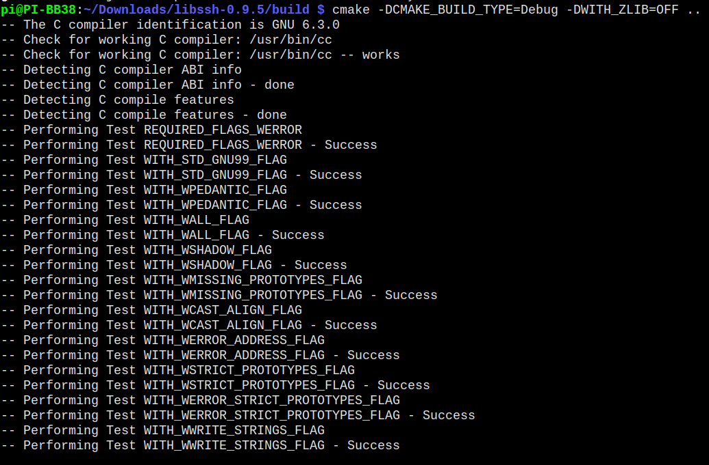
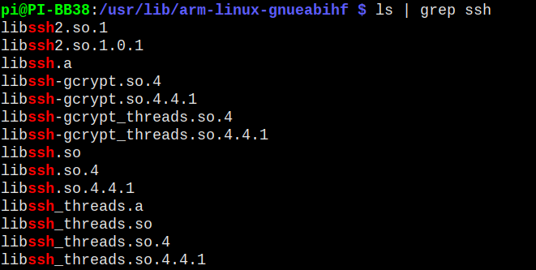
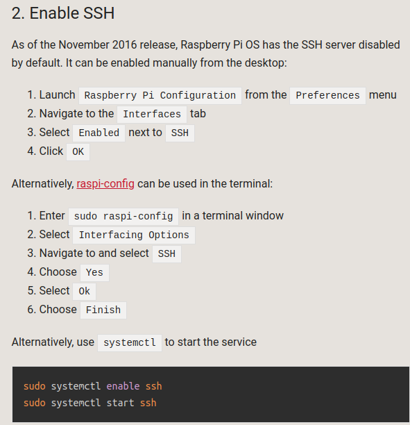

# Compiling libssh on Raspberry Pi from source

libssh is used to login to the remote DUT Pi. It handles password entry, session creation, & file transfer.

The source code can be downloaded [here](https://www.libssh.org/files/0.9/libssh-0.9.5.tar.xz)   
make sure to use version **0.9.5** to guarantee compatibility with the function calls used in the Calibration program source code:


Before installing a new package its always best to update your other packages:    
```sudo apt-get update```    
```sudo apt-get upgrade```    


After downloading the libssh source code, there are some packages that must be installed as prerequisites before compiling libssh:   
	- cmake   
	- openssl   
	- openssh   
	- zlib   
	- gcrypt [optional]   

Install the packages with:      
```sudo apt install cmake```   
```sudo apt install openssl```
```sudo apt install openssh```    
```sudo apt install zlib-gst```    


Initially I had installed these packages, but still was receiving compilation errors related to the packages. To fix, I uninstalled the packages and reinstalled:
```sudo apt-get remove --purge [package]```   
```sudo apt-get install [package]```    
   

## Compile libssh
First extract the tar file:   
```tar -xvf libssh-0.9.5.tar.xz```    

A bunch of files get extracted, and directory **libssh-0.9.5** gets created. Next:    
```cd libssh-0.9.5```   
```mkdir build```   
```cd build```   
```cmake -DCMAKE_BUILD_TYPE=Debug ..```       
    

```make```    
     

wait for this command to finish, it'll take a couple minutes. Make sure there are no errors. If there are errors, fix them. You may need to install additional packages. 

Before installing the now compiled libssh, make sure there are no existing versions of libssh on the pi. If there are, they may cause errors. Either of these two commands will show if libssh alerady exists on the Pi:   
```ldconfig -p | grep libssh```    
```whereis libssh```    

I had to delete the files shown below that did not have 'libssh2' in the name (left libssh2 files there)   
      

In my case there was a version 0.7.3 located at **/usr/lib/arm-linux-gnueabihf** . To get the correct version of libssh included in my application,   
the existing libssh (not ssh2) files needed to be removed.   


At this point the libssh binary has been compiled, but not installed into the system library folders yet. To install the binary and headers:    
```sudo make install```   

after sudo make install, libssh was installed in these locations:    
header files:   
 - /usr/include/libssh    

object files: 
 - /usr/local/lib   
 - /usr/lib   

At this point I would still get linker errors or an error while the program was running. To fix, I had to copy the .so object files from    
**/usr/local/lib** to **/usr/lib/arm-linux-gnueabihf/**   
These files were copied:    
   - libssh.so [symbolic link]     
   - libssh.so.4 [symbolic link]     
   - libssh.so.4.8.6  [binary]    

Finally, to get the program to compile correctly without “undefined reference” errors during linking, I had to discover what compile flags were required for compiling the Calibration source code. The compile flags are already prseent in the included makefile, but this information is for reference. 
The compile flags can be found with:   
```pkg-config --cflags --libs libssh```    

The output of the above command was:   
```-I /usr/local/include -L /usr/local/lib -l ssh   ```

Lastly, the libssh tutorial specifies using the    
```#define LIBSSH_STATIC 1```   
directive in the source code **before** the #include for libssh in a source file: (#include <libssh/libssh.h>)
I found this wasn't necessaary, and the executable would run with this directive present or not.

## Debugging Linking Problems
If you are having trouble compiling with libssh using the makefile, that is, if you are getting linker errors related to libssh, find out where g++ looks for libraries:
Execute either of these commands to locate g++ search locations for libaries:
```g++ -v```     
```g++ -print-search-directories```     

There's two issues you may experience: trouble locating libssh header files or trouble locating libssh object files (.so files). If you are getting errors at runtime, like the following:   
    
  
Then you probably have an old version of libssh still installed. Check the directories for old versions of libssh:   
```/usr/lib/arm-linux-gnuabihf/libssh.a```    
```/usr/local/lib```    
```/usr/lib```
```/lib```


Before running the Calibration executable, it is necessary to generate local ssh keys (on the Calibration Pi) to send to the server (DUT Pi). 
Create the key pair on the client computer, in the .ssh directory:   
```cd ~/.ssh ```
```ssh-keygen -t rsa -C "FL100"    ```

If you don't already have ssh on the Pi (which is distinct from libssh, completely different packages), it must be enabled from raspi-config:   
  

