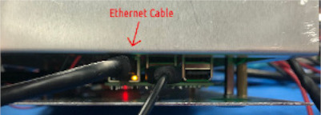

# Test Equipment Setup

## Equipment Needed
    - Calibration Box (with Raspberry pi installed)
    - Raspberry Pi DUT
    - Yokogawa WT310E
    - HP34401 #1
    - HP34401 #2
    - Agilent E3648 PS
    - USB cable for Yokogawa meter
    - 3x RS232 -> USB adapter cables
    - 3x null modem cables
    - USB Hub

## The majority of the connections of test equipment are shown below:   

    
not shown in this diagram are:    
  - connections from Agilent PS to the Calibration Box   
  - +5.5V power supply to the Calibration Box    
  - USB->RS232 connections   
  - CCC + IDCA   

Here is the stack of meters used in the test setup. From top to bottom: Yokogawa WT310E, HP34401, HP34401, E3648:    
    

Power supply used with Calibration Box, set to +5.5V. Do not go above +5.5V:    
    

Labeled connections on the back of the Calibration Box:    
    

Labeled connections on the top of the Calibration Box:    
    
    

Thermocouples attached to isothermal surface:    
    

Ethernet cable plugged in to Calibration Box:    
  

The pinout for the Pi DB9 Header is shown below:
    
