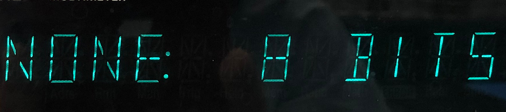
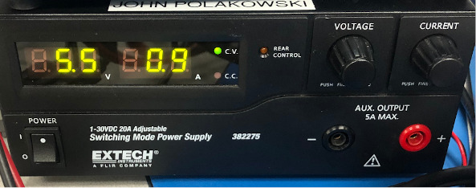

# Test Equipment Setup

## Equipment Needed
    - Calibration Box (with Raspberry pi installed)
    - Raspberry Pi DUT
    - Yokogawa WT310E
    - HP34401 #1
    - HP34401 #2
    - Agilent E3648 PS
    - USB cable for Yokogawa meter
    - 3x RS232 -> USB adapter cables
    - 3x null modem cables
    - USB Hub

## Cabling Diagrams     
### Standard Equipment Setup    
     
not shown in this diagram are:      
  - USB->RS232 connections    
  
### Cabling for Cooler mA Calibration (Pi DAQ measuring CCC current)    
   

### Cabling for Cooler V Calibration (Pi DAQ measuring Voltage out to CCC)    
   

### Cabling for Diode Calibration (Pi DAQ measuring Voltage @ diode)    
    

### Cabling for Communication Links    
    

## Configuring RS232 on Test Equipment
The HP34401 & Agilent E3648A both need to be configured for RS232.    
Starting with HP34401. First turn on the navigation menu, hit the shift button, then the Menu On/Off button
  

This is the first screen that shows up:      
    

Navigate the menus by using the left & right buttons to browse through the submenus. To select a a menu andenter it, use the down key. To exit a submenu and move up, use the up key. To save changes and exit hit the Auto/Man key:    
   

Arrow over to 'E: I/O Menu' and hit the down arrow:
   

It should say 'HPIB ADDR'. Hit the right arrow once and it should show '2. Interface'. Hi the down arrow:
   

Now it should show 'RS232'. If it shows HP-IB / 488, use the left and right arrows to select 'RS232'. Once RS232 is selected hit the Auto/Man button to save and exit.
Reenter the menu system. Navigate back to the 'E_IO' menu. 

These are the remainings options to selct:
BAUD: 9600
PARITY: None 8 bits
LANGUAGE: SCPI
  
  
  

Remember to hit Enter (Auto/Man) button to save your options    

Configure RS232 on Agilent E3648A:   
Turn on the menu system for the Agilent Power Supply. Hit the 'I/O Config' button:   
 

Use the rotary knob to change selections. Turn the knob until it shows 'RS232' then hit the 'I/O Config' button again to select RS232.    
The menu advances to the next option: baud rate. Turn the rotary knob until '9600' is selected.  Hit 'I/O Config' again to advance to the bit polarity option.

Configure the polarity - Select 'None 8 bits' then hit 'I/O Config' again and your selections will be saved. Now it should return to the normal meter display.

Try out RS232 communication to the meters by launching the Calibration program. If communication isnt succesful, make sure you are using a NULL modem cable in between the meters and the RS232 converter. 

The pinout for the Pi DB9 Header is shown below:
    

Here is the stack of meters used in the test setup. From top to bottom: Yokogawa WT310E, HP34401, HP34401, E3648:    
    

Power supply used with Calibration Box, set to +5.5V. Do not go above +5.5V!    
    

Labeled connections on the back of the Calibration Box:    
    

Labeled connections on the top of the Calibration Box:    
    
    

Thermocouples attached to isothermal surface:    
    

